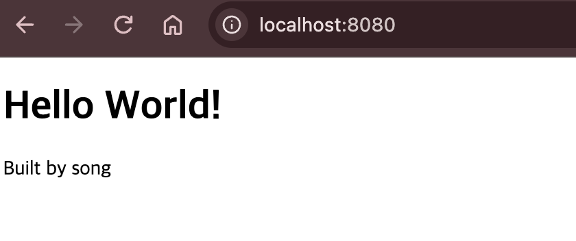

# 프로젝트 개요
이번 과제를 통하여 협업 과정에서 파편화된 개발환경을 표준화하기위해 DOCKER를 통해 격리된 컨테이너 개발 환경을 구성하고 공유하는 방법을 학습한다.


# 실행 환경
```bash
uname -a
echo "$SHELL"
$SHELL --version
docker --version
git --version
```
### 결과
```bash
Darwin MacBook-Pro-3.local 25.5.0 Darwin Kernel Version 25.5.0: Tue Jun  9 22:28:17 PDT 2026; root:xnu-12377.121.10~1/RELEASE_ARM64_T8142 arm64
/bin/zsh
zsh 5.9 (arm64-apple-darwin25.0)
Docker version 29.7.1, build e9452d6e78
git version 2.50.1 (Apple Git-155)
```

# 수행 항목 체크리스트

- [x] 터미널 기본 조작 (위치/목록/이동/생성/복사/이동·이름변경/삭제/내용확인/빈 파일)
- [x] 권한 변경 실습 (파일·디렉토리 각 1개 이상, 변경 전/후 비교)
- [x] Docker 설치/점검 (`docker --version`, `docker info`)
- [x] `hello-world` 실행
- [x] `ubuntu` 컨테이너 진입 + attach/exec 차이 관찰
- [x] 기존 Dockerfile 기반 커스텀 이미지 빌드/실행
- [x] 포트 매핑 접속 (2회, 브라우저/curl 증거)
- [x] 바인드 마운트 반영 (호스트 변경 전/후)
- [x] Docker 볼륨 영속성 (컨테이너 삭제 전/후)
- [x] Git 설정 + GitHub/VSCode 연동
- [x] 트러블슈팅 2건 이상
- [x] (보너스) Docker Compose, 환경변수, SSH 키

# 개념

### ① 절대 경로 vs 상대 경로
* **절대 경로**: 최상위 루트 디렉토리(`/`)부터 시작하는 고유한 전체 경로 (예: `/Users/one/dev-workstation/app`)
* **상대 경로**: 현재 위치 디렉토리(`.`)를 기준으로 상대적인 위치를 나타내는 경로 (예: `./app/index.html`)

### ② 파일 권한의 의미 (r/w/x) 및 표기법 (755, 644)
* **r (Read=4), w (Write=2), x (Execute=1)** 로 표기되며, [소유자 / 그룹 / 기타 사용자] 3개 군으로 구성.
* **755 (`rwxr-xr-x`)**: 소유자에게 읽기/쓰기/실행(4+2+1=7), 그룹 및 기타 사용자에게 읽기/실행(4+1=5) 권한 부여 (디렉토리 표준 권한)
* **644 (`-rw-r--r--`)**: 소유자에게 읽기/쓰기(4+2=6), 그룹 및 기타 사용자에게 읽기(4) 권한 부여 (일반 파일 표준 권한)

### ③ 커스텀 이미지 제작 원리
기존 베이스 이미지(`nginx:alpine`)에 필요한 레이어(커스텀 파일(`index.html`), 환경 설정 등)를 `Dockerfile` 명세서로 정의한 후 `docker build` 로 재사용 가능한 단일 파일 형태의 이미지를 생성.

### ④ 포트 매핑이 필요한 이유
Docker 컨테이너는 격리, 독립 네트워크 환경을 가짐. 따라서 호스트 PC 외부에서 컨테이너 내부 서비스에 접근하려면 호스트 포트와 컨테이너 트를 연결(`-p host_port:container_port`)해 주는 절차가 필수.

### ⑤ Docker 볼륨 (Volume)
컨테이너의 수명 주기(Lifecycle)와 독립되게 데이터를 '영속적'으로 저장하는 Docker 관리 영역. 컨테이너가 삭제되거나 재생성되어도 데이터 유실을 방지.

### ⑥ attach vs exec 차이

attach: 컨테이너의 메인 프로세스(PID 1)의 표준 입출력(STDOUT/STDIN)에 직접 연결. 메인 프로세스가 종료(exit)되면 컨테이너도 함께 종료.

exec: 이미 실행 중인 컨테이너 내부에 새로운 별도 프로세스를 추가로 띄워 명령을 수행. 작업을 마치고 나와도 메인 컨테이너는 계속 실행 상태를 유지.


# 검증
## 터미널 조작
* 위치/목록 확인
```bash
❯ pwd
/Users/one/Codyssey/E1-1

❯ ls -la
total 8
drwxr-xr-x   6 one  staff   192 Aug  5 14:13 .
drwxr-xr-x   4 one  staff   128 Aug  4 16:42 ..
-rw-r--r--@  1 one  staff     0 Aug  5 14:00 .hidden.txt
drwxr-xr-x@ 23 one  staff   736 Aug  5 14:12 .history
-rw-r--r--@  1 one  staff  1531 Aug  5 14:12 README.md
-rw-r--r--@  1 one  staff     0 Aug  5 14:00 test.txt
```
* 빈 파일 생성, 파일 내용 확인
```bash
❯ ls
❯ touch hello.txt
❯ cat hello.txt

❯ echo 'hello' > hello.txt
❯ cat hello.txt
hello
```
* 복사, 이동/이름 변경, 삭제
```bash
❯ ls
hello.txt
❯ cp hello.txt hello_copy.txt
❯ ls
hello_copy.txt  hello.txt
❯ mv hello_copy.txt hello_renamed.txt
❯ ls
hello_renamed.txt       hello.txt
❯ rm hello_renamed.txt
❯ ls
hello.txt
```
* 권한 설정
```bash
# 변경 전
❯ ls -l test.txt
-rw-r--r--  1 one  staff  0 Aug  5 14:00 test.txt
# 권한 변경: 실행 권한 추가
❯ chmod 755 test.txt
# 변경 후
❯ ls -l test.txt
-rwxr-xr-x  1 one  staff  0 Aug  5 14:00 test.txt

❯ ls -l test_dir
total 8
-rw-r--r--@ 1 one  staff  6 Aug  5 14:45 hello.txt
❯ chmod 644 test_dir
❯ ls -l test_dir
total 0
ls: fts_read: Permission denied
```

## Docker
### 설치 점검
```bash
❯ docker --version
Docker version 29.7.1, build e9452d6e78

❯ docker info
Client: Docker Engine - Community
 Version:    29.7.1
 Context:    orbstack
 Debug Mode: false
 Plugins:
  ai: Docker AI Agent - Ask Gordon (Docker Inc.)
    Version:  v1.18.0
    Path:     /Users/one/.docker/cli-plugins/docker-ai
  buildx: Docker Buildx (Docker Inc.)
    Version:  v0.33.0
    Path:     /Users/one/.docker/cli-plugins/docker-buildx
  compose: Docker Compose (Docker Inc.)
    Version:  v5.1.2
    Path:     /Users/one/.docker/cli-plugins/docker-compose
  debug: Get a shell into any image or container (Docker Inc.)
    Version:  0.0.47
    Path:     /Users/one/.docker/cli-plugins/docker-debug
  desktop: Docker Desktop commands (Docker Inc.)
    Version:  v0.3.0
    Path:     /Users/one/.docker/cli-plugins/docker-desktop
  extension: Manages Docker extensions (Docker Inc.)
    Version:  v0.2.31
    Path:     /Users/one/.docker/cli-plugins/docker-extension
  init: Creates Docker-related starter files for your project (Docker Inc.)
    Version:  v1.4.0
    Path:     /Users/one/.docker/cli-plugins/docker-init
  mcp: Docker MCP Plugin (Docker Inc.)
    Version:  v0.39.1
    Path:     /Users/one/.docker/cli-plugins/docker-mcp
  model: Docker Model Runner (Docker Inc.)
    Version:  v1.0.8
    Path:     /Users/one/.docker/cli-plugins/docker-model
  offload: Docker Offload (Docker Inc.)
    Version:  v0.5.45
    Path:     /Users/one/.docker/cli-plugins/docker-offload
  pass: Docker Pass Secrets Manager Plugin (beta) (Docker Inc.)
    Version:  v0.0.24
    Path:     /Users/one/.docker/cli-plugins/docker-pass
  sandbox: Docker Sandbox (Docker Inc.)
    Version:  v0.12.0
    Path:     /Users/one/.docker/cli-plugins/docker-sandbox
  sbom: View the packaged-based Software Bill Of Materials (SBOM) for an image (Anchore Inc.)
    Version:  0.6.0
    Path:     /Users/one/.docker/cli-plugins/docker-sbom
  scout: Docker Scout (Docker Inc.)
    Version:  v1.19.0
    Path:     /Users/one/.docker/cli-plugins/docker-scout

Server:
 Containers: 0
  Running: 0
  Paused: 0
  Stopped: 0
 Images: 6
 Server Version: 29.4.0
 Storage Driver: overlayfs
  driver-type: io.containerd.snapshotter.v1
 Logging Driver: json-file
 Cgroup Driver: cgroupfs
 Cgroup Version: 2
 Plugins:
  Volume: local
  Network: bridge host ipvlan macvlan null overlay
  Log: awslogs fluentd gcplogs gelf journald json-file local splunk syslog
 CDI spec directories:
  /etc/cdi
  /var/run/cdi
 Swarm: inactive
 Runtimes: io.containerd.runc.v2 runc
 Default Runtime: runc
 Init Binary: docker-init
 containerd version: 301b2dac98f15c27117da5c8af12118a041a31d9
 runc version: bb14dabeb7185bb72c8c86735d090dcb20f36587
 init version: de40ad0
 Security Options:
  seccomp
   Profile: builtin
  cgroupns
 Kernel Version: 7.0.14-orbstack-00374-gbbca68e8d741
 Operating System: OrbStack
 OSType: linux
 Architecture: aarch64
 CPUs: 10
 Total Memory: 7.818GiB
 Name: orbstack
 ID: e37f3bd8-ed3a-43b9-b771-fc01c7ffcb05
 Docker Root Dir: /var/lib/docker
 Debug Mode: false
 HTTP Proxy: http://proxy.orb.internal:8305
 HTTPS Proxy: http://proxy.orb.internal:8305
 No Proxy: localhost,127.0.0.1,127.0.0.0/8,::1,10.0.0.0/8,172.16.0.0/12,192.168.0.0/16,0.250.250.0/24,*.orb.internal,*.local,gateway.docker.internal,host.internal,host.docker.internal,host.lima.internal,docker.for.mac.localhost,docker.for.mac.host.internal
 Experimental: true
 Insecure Registries:
  127.0.0.0/8
  ::1/128
 Live Restore Enabled: false
 Product License: Community Engine
 Default Address Pools:
   Base: 192.168.97.0/24, Size: 24
   Base: 192.168.107.0/24, Size: 24
   Base: 192.168.117.0/24, Size: 24
   Base: 192.168.147.0/24, Size: 24
   Base: 192.168.148.0/24, Size: 24
   Base: 192.168.155.0/24, Size: 24
   Base: 192.168.156.0/24, Size: 24
   Base: 192.168.158.0/24, Size: 24
   Base: 192.168.163.0/24, Size: 24
   Base: 192.168.164.0/24, Size: 24
   Base: 192.168.165.0/24, Size: 24
   Base: 192.168.166.0/24, Size: 24
   Base: 192.168.167.0/24, Size: 24
   Base: 192.168.171.0/24, Size: 24
   Base: 192.168.172.0/24, Size: 24
   Base: 192.168.181.0/24, Size: 24
   Base: 192.168.183.0/24, Size: 24
   Base: 192.168.186.0/24, Size: 24
   Base: 192.168.207.0/24, Size: 24
   Base: 192.168.214.0/24, Size: 24
   Base: 192.168.215.0/24, Size: 24
   Base: 192.168.216.0/24, Size: 24
   Base: 192.168.223.0/24, Size: 24
   Base: 192.168.227.0/24, Size: 24
   Base: 192.168.228.0/24, Size: 24
   Base: 192.168.229.0/24, Size: 24
   Base: 192.168.237.0/24, Size: 24
   Base: 192.168.239.0/24, Size: 24
   Base: 192.168.242.0/24, Size: 24
   Base: 192.168.247.0/24, Size: 24
   Base: fd07:b51a:cc66:d000::/56, Size: 64
 Firewall Backend: iptables

WARNING: DOCKER_INSECURE_NO_IPTABLES_RAW is set
```

### 기본 운영 명령 수행
```bash
❯ docker images
IMAGE                           ID             DISK USAGE   CONTENT SIZE   EXTRA
newproject-backend:latest       a6c84a008c90        526MB          255MB    U
newproject-frontend:latest      772f10f1ca4d        1.5GB          737MB

❯ docker ps
CONTAINER ID   IMAGE          COMMAND                  CREATED          STATUS          PORTS     NAMES
3137d1b29a38   a6c84a008c90   "/dev/shm/.orb-wormh…"   20 seconds ago   Up 19 seconds             orb-wormhole-temp-806c7b56
❯ docker ps -a
CONTAINER ID   IMAGE          COMMAND                  CREATED          STATUS          PORTS     NAMES
3137d1b29a38   a6c84a008c90   "/dev/shm/.orb-wormh…"   28 seconds ago   Up 27 seconds             orb-wormhole-temp-806c7b56

❯ docker stats
CONTAINER ID   NAME                         CPU %     MEM USAGE / LIMIT     MEM %     NET I/O           BLOCK I/O         PIDS
3137d1b29a38   orb-wormhole-temp-806c7b56   0.00%     5.914MiB / 7.818GiB   0.07%     12.3kB / 2.06kB   22.6MB / 61.4kB   5
❯ docker logs 3137d1b29a38
```

### hello-world 실행
```bash
❯ docker run --name hello hello-world
zsh: command not found: #
Unable to find image 'hello-world:latest' locally
latest: Pulling from library/hello-world
58dee6a49ef1: Pull complete
c3bdf82c34d1: Download complete
Digest: sha256:5dd0d3e6e255913fc30f90b9f2b1d359cc2cbdb48090cc4b65f1676e203243cc
Status: Downloaded newer image for hello-world:latest

Hello from Docker!
This message shows that your installation appears to be working correctly.

To generate this message, Docker took the following steps:
 1. The Docker client contacted the Docker daemon.
 2. The Docker daemon pulled the "hello-world" image from the Docker Hub.
    (arm64v8)
 3. The Docker daemon created a new container from that image which runs the
    executable that produces the output you are currently reading.
 4. The Docker daemon streamed that output to the Docker client, which sent it
    to your terminal.

To try something more ambitious, you can run an Ubuntu container with:
 $ docker run -it ubuntu bash

Share images, automate workflows, and more with a free Docker ID:
 https://hub.docker.com/

For more examples and ideas, visit:
 https://docs.docker.com/get-started/
```

### Ubuntu 실행
```bash
❯ docker run --name ubun ubuntu

docker ps -a
Unable to find image 'ubuntu:latest' locally
latest: Pulling from library/ubuntu
50914c2b24a1: Pull complete
ed8299a102e9: Pull complete
ee7f14aa75fd: Download complete
Digest: sha256:6df9e8dd1eac389ebfef692c9648449adeb815d01e16e29cd6f3e50fe64ba9a6
Status: Downloaded newer image for ubuntu:latest
CONTAINER ID   IMAGE         COMMAND       CREATED              STATUS                              PORTS     NAMES
36187b7a8afa   ubuntu        "/bin/bash"   5 seconds ago        Exited (0) Less than a second ago             ubun
3d587e3a2cd9   hello-world   "/hello"      About a minute ago   Exited (0) About a minute ago                 hello
```

### attach vs exec
```bash
#attach
❯ docker run -itd  ubuntu /bin/bash
e8f72ad4b54d2a1180d1c9819d589452ed1f71a70ec292048682db0d9ee7740c
❯ docker ps
CONTAINER ID   IMAGE     COMMAND       CREATED         STATUS         PORTS     NAMES
e8f72ad4b54d   ubuntu    "/bin/bash"   2 seconds ago   Up 2 seconds             serene_moore
❯ docker attach e8f72ad4b54d
root@e8f72ad4b54d:/# exit
exit
❯ docker ps
CONTAINER ID   IMAGE     COMMAND   CREATED   STATUS    PORTS     NAMES

#exec
❯ docker exec -it e8f72ad4b54d /bin/bash

What's next:
    Try Docker Debug for seamless, persistent debugging tools in any container or image → docker debug e8f72ad4b54d
    Learn more at https://docs.docker.com/go/debug-cli/
Error response from daemon: container e8f72ad4b54d2a1180d1c9819d589452ed1f71a70ec292048682db0d9ee7740c is not running
❯ docker exec -it 3c38c98338d4 /bin/bash
root@3c38c98338d4:/# exit
exit

What's next:
    Try Docker Debug for seamless, persistent debugging tools in any container or image → docker debug 3c38c98338d4
    Learn more at https://docs.docker.com/go/debug-cli/
❯ docker ps
CONTAINER ID   IMAGE     COMMAND       CREATED              STATUS              PORTS     NAMES
3c38c98338d4   ubuntu    "/bin/bash"   About a minute ago   Up About a minute             ecstatic_sammet
```

## 커스텀 Nginx이미지 빌드
welcome page
index.html
```html
<!doctype html>
<html lang="ko">
  <head>
    <meta charset="utf-8" />
    <meta name="viewport" content="width=device-width, initial-scale=1" />
    <title>Dev Workstation</title>
  </head>
  <body>
    <h1>Docker Web Server Works!</h1>
    <p>Built by [교체 필요: 이름 또는 GitHub 사용자명]</p>
  </body>
</html>
```
DockerFile
```
8.2 Dockerfile
FROM nginx:1.27-alpine

COPY app/index.html /usr/share/nginx/html/index.html

EXPOSE 80
```
이미지 빌드
```bash
❯ docker build -t custom-nginx:1.0 .
docker images custom-nginx
[+] Building 2.9s (7/7) FINISHED                                                                                                                             docker:orbstack
 => [internal] load build definition from Dockerfile                                                                                                                    0.0s
 => => transferring dockerfile: 120B                                                                                                                                    0.0s
 => [internal] load metadata for docker.io/library/nginx:1.27-alpine                                                                                                    0.9s
 => [internal] load .dockerignore                                                                                                                                       0.0s
 => => transferring context: 2B                                                                                                                                         0.0s
 => [internal] load build context                                                                                                                                       0.0s
 => => transferring context: 292B                                                                                                                                       0.0s
 => [1/2] FROM docker.io/library/nginx:1.27-alpine@sha256:65645c7bb6a0661892a8b03b89d0743208a18dd2f3f17a54ef4b76fb8e2f2a10                                              1.7s
 => => resolve docker.io/library/nginx:1.27-alpine@sha256:65645c7bb6a0661892a8b03b89d0743208a18dd2f3f17a54ef4b76fb8e2f2a10                                              0.0s
 => => sha256:9994ea1088e3f1d0eb3dea855f32e7e63742b2644c8611c124ba81bc3453047e 16.03MB / 16.03MB                                                                        0.6s
 => => sha256:37aca2470cdaf48d251d9308c09dc8735b45ebcbefada46537c9989991b3fe6d 1.40kB / 1.40kB                                                                          0.5s
 => => sha256:a4ce1202d74643d4e4ce15787afc2402a18802e3d7bfd0f6bf60c912b57eec1f 405B / 405B                                                                              0.7s
 => => sha256:1ab010a063387e697fc32bb43022532c0e275d2e51fb65c2ac541e082e610a33 1.21kB / 1.21kB                                                                          0.7s
 => => sha256:e6557c42ebeaea010d8a8883fdacdc5a17dea1221416d0d980e206dd42dc7e29 627B / 627B                                                                              0.2s
 => => sha256:d3282d7e6b7633cf153dce0ca1c72b6ea574edb0b34351f848fb16b7d13c851f 957B / 957B                                                                              0.2s
 => => sha256:c60e446e49a0b607fd79968afdc54cedce67644990a3930925add6caf577779d 1.79MB / 1.79MB                                                                          0.3s
 => => sha256:6e771e15690e2fabf2332d3a3b744495411d6e0b00b2aea64419b58b0066cf81 3.99MB / 3.99MB                                                                          0.3s
 => => extracting sha256:6e771e15690e2fabf2332d3a3b744495411d6e0b00b2aea64419b58b0066cf81                                                                               0.1s
 => => extracting sha256:c60e446e49a0b607fd79968afdc54cedce67644990a3930925add6caf577779d                                                                               0.1s
 => => extracting sha256:e6557c42ebeaea010d8a8883fdacdc5a17dea1221416d0d980e206dd42dc7e29                                                                               0.0s
 => => extracting sha256:d3282d7e6b7633cf153dce0ca1c72b6ea574edb0b34351f848fb16b7d13c851f                                                                               0.0s
 => => extracting sha256:a4ce1202d74643d4e4ce15787afc2402a18802e3d7bfd0f6bf60c912b57eec1f                                                                               0.0s
 => => extracting sha256:1ab010a063387e697fc32bb43022532c0e275d2e51fb65c2ac541e082e610a33                                                                               0.0s
 => => extracting sha256:37aca2470cdaf48d251d9308c09dc8735b45ebcbefada46537c9989991b3fe6d                                                                               0.0s
 => => extracting sha256:9994ea1088e3f1d0eb3dea855f32e7e63742b2644c8611c124ba81bc3453047e                                                                               0.1s
 => [2/2] COPY index.html /usr/share/nginx/html/index.html                                                                                                              0.1s
 => exporting to image                                                                                                                                                  0.1s
 => => exporting layers                                                                                                                                                 0.1s
 => => exporting manifest sha256:285443f89401dac987f48c9a8745a385cf43a7a8c27e2ba99995b160f933e695                                                                       0.0s
 => => exporting config sha256:4875666374b500c32b0f2c0dc028364f707068a846176b6fdcf116b2edd7039b                                                                         0.0s
 => => exporting attestation manifest sha256:8187ed382547a71a73e08781a2004d868e9465ce42225ab810baa806ef82ed5e                                                           0.0s
 => => exporting manifest list sha256:e0b7b153fadb040bbaffc09f96c3dd696e6938deb39b5501dd1f2f0555a010d4                                                                  0.0s
 => => naming to docker.io/library/custom-nginx:1.0                                                                                                                     0.0s
 => => unpacking to docker.io/library/custom-nginx:1.0                                                                                                                  0.0s
                                                                                                                                                         i Info →   U  In Use
IMAGE              ID             DISK USAGE   CONTENT SIZE   EXTRA
custom-nginx:1.0   e0b7b153fadb       77.3MB         21.8MB
```


## 컨테이너 실행, 포트매핑
```bash
❯ docker run -d \
  --name custom-nginx \
  -p 8080:80 \
  custom-nginx:1.0

curl -i http://localhost:8080
docker: Error response from daemon: Conflict. The container name "/custom-nginx" is already in use by container "eb83b6aa42f76b1e945618e4f5bd741d4f720397bbde787e61ffee02e80bb8cb". You have to remove (or rename) that container to be able to reuse that name.

Run 'docker run --help' for more information
HTTP/1.1 200 OK
Server: nginx/1.27.5
Date: Wed, 19 Aug 2026 12:56:02 GMT
Content-Type: text/html
Content-Length: 253
Last-Modified: Wed, 19 Aug 2026 12:44:22 GMT
Connection: keep-alive
ETag: "6a85a526-fd"
Accept-Ranges: bytes

<!doctype html>
<html lang="ko">

<head>
  <meta charset="utf-8" />
  <meta name="viewport" content="width=device-width, initial-scale=1" />
  <title>Dev Workstation</title>
</head>

<body>
  <h1>Hello World!</h1>
  <p>Built by song</p>
</body>

</html>%
```
브라우저 접속


## 바인드 마운트
```bash
docker run -d \
  --name custom-nginx-bind \
  -p 8080:80 \
  --mount type=bind,source="$(pwd)/app",target=/usr/share/nginx/html,readonly \
  nginx:1.27-alpine

curl -s http://localhost:8080
```
파일 변경 반영
```html
curl -s http://localhost:8080
<!doctype html>
<html lang="ko">

<head>
  <meta charset="utf-8" />
  <meta name="viewport" content="width=device-width, initial-scale=1" />
  <title>Dev Workstation</title>
</head>

<body>
  <h1>Hello World!</h1>
  <p>Built by song UPDATED!</p>
</body>

</html>
```

## Docker 볼륨영속성 검증
```bash
# 볼륨 생성, 목록 확인
docker volume create temp-volume
docker volume ls
# 볼륨 연결 및 데이터 생성
❯ docker run --name ubuntu -v temp-volume:/data ubuntu sh -c 'echo "볼륨데이터" > /data/text.txt; cat /data/text.txt'
볼륨데이터
❯ docker ps
CONTAINER ID   IMAGE               COMMAND                  CREATED        STATUS        PORTS                                     NAMES
9051c941b64f   nginx:1.27-alpine   "/docker-entrypoint.…"   16 hours ago   Up 16 hours   0.0.0.0:8080->80/tcp, [::]:8080->80/tcp   custom-nginx-bind
3c38c98338d4   ubuntu              "/bin/bash"              17 hours ago   Up 17 hours                                             ecstatic_sammet
❯ docker ps -la
CONTAINER ID   IMAGE     COMMAND                   CREATED          STATUS                      PORTS     NAMES
3fcd6b4ea12d   ubuntu    "sh -c 'echo \"볼륨데…"   15 minutes ago   Exited (0) 15 minutes ago             ubuntu
#컨테이너 제거
docker rm ubuntu
docker ps -a -f name=ubuntu
Error response from daemon: No such container: ubuntu
CONTAINER ID   IMAGE     COMMAND   CREATED        STATUS                    PORTS     NAMES
#볼륨데이터 존속 확인
docker run --rm -v temp-volume:/data ubuntu cat /data/text.txt
볼륨데이터
```

### Git 설정 및 GitHub 연동